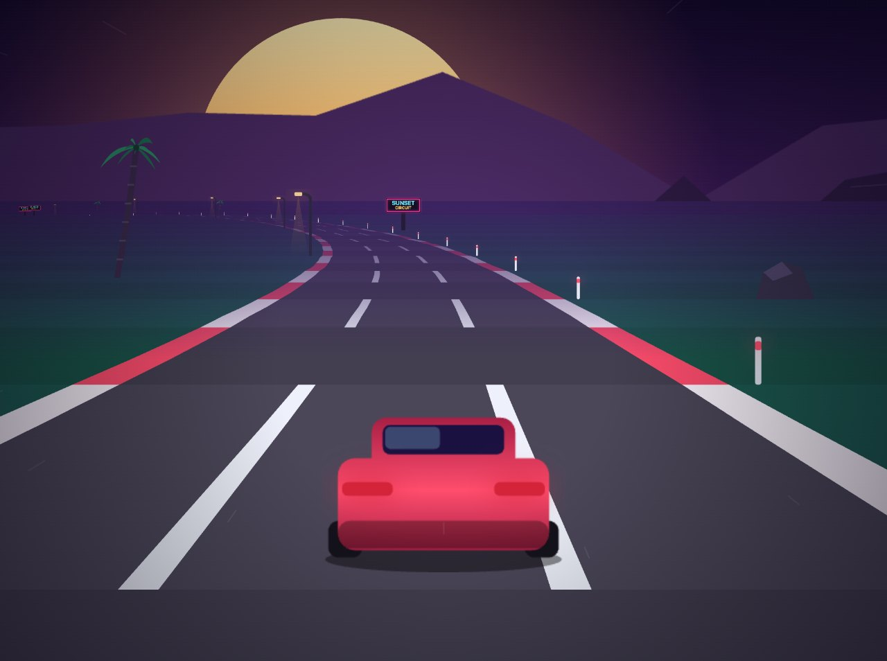

# Sunset Circuit

A pseudo-3D arcade racer that runs in the browser. No build step, no
dependencies, no image files — the road is projected segment by segment and
every sprite is drawn in code at load time.

**▶ [Play it](https://ctbot000.github.io/car-racing-game/)**



## The game

You are on a 2.5 km circuit with a clock that never stops draining. Each
checkpoint tops it back up — and tops it up a little less every time. Run out of
time and the run ends; the score is how far you got.

| | |
|---|---|
| **Steer** | `←` `→` or `A` `D` |
| **Throttle** | `↑` or `W` |
| **Brake** | `↓`, `S` or `Space` |
| **Pause** | `P` or `Esc` |
| **Restart** | `R` |
| **Mute** | `M` |

On a touch screen the throttle is automatic and steering and braking are
on-screen pads.

Three things are worth knowing:

- **Lift for the corners.** Curves throw the car to the outside, harder the
  faster you are going. Flat out through the hairpin puts you on the grass, and
  the grass caps you at a third of your top speed.
- **Pass close.** Overtaking within about a car's width builds a streak, and the
  streak multiplies everything discretionary you earn — the next pass and the
  next checkpoint. It resets if you crash or leave the road.
- **Crashing costs time, not the run.** A collision scrubs your speed, and speed
  is what buys checkpoints.

## Running it

Any static file server works; there is nothing to build.

```bash
python3 -m http.server 8000
```

Then open <http://localhost:8000>. ES modules need a real origin, so opening
`index.html` from the filesystem will not work.

## Tests

The simulation is deliberately free of any DOM dependency, so the browser build
and the test suite run the same code.

```bash
npm test
```

Fifteen tests, about two seconds. They cover the ordinary invariants (the car
never leaves the world, no state value goes non-finite, the circuit's elevation
closes at the start line) and the balance rules that are easy to break by
accident:

- **Difficulty never eases.** The survival threshold is a pure function of
  progress, checked to 400 checkpoints.
- **The clock's reference pace is real.** `UNIT_COST_SECONDS` is asserted
  against what a flawless simulated driver actually achieves, so changing the
  track or the physics without re-measuring fails the build rather than silently
  redefining every difficulty number.
- **A flawless driver is not punished for driving perfectly.** A controller with
  no injected error crashing often means the traffic has become unavoidable, not
  that the game got hard.
- **Survival falls monotonically as driver error rises**, and every run ends.
- **The streak multiplier separates skill more sharply than survival does** —
  which is the whole reason it compounds.

`test/bot.js` is the instrument the balance tests are read through: four
driver profiles whose error is sampled once per *decision* — per car
encountered, per corner approached — rather than per tick, because a per-tick
miss chance is an 8 ms delay rather than a handicap and leaves the survival
curve flat however high it is turned up.

## Layout

```
index.html
css/style.css
js/
  sim/            the simulation — no DOM, imported by the tests
    config.js     every tuning number, in one unit system
    track.js      circuit generation
    player.js     car physics
    traffic.js    spawning, lane discipline, recycling
    sim.js        the race state machine
    util.js
  render.js       the pseudo-3D road renderer
  sprites.js      every sprite, drawn in code onto offscreen canvases
  game.js         phase machine and fixed-timestep loop
  hud.js  input.js  audio.js  storage.js  main.js
test/
```

## How a few things work

**The clock.** Difficulty is one number. The clock drains continuously and is
topped up a fixed amount per checkpoint, so with a buffer of `M` units' worth of
time and a top-up worth `k` of a unit's cost, play is sustainable exactly while

```
actual seconds per checkpoint / optimal seconds per checkpoint  <  k
```

`k` falls monotonically with progress. Early checkpoints bank time; later ones
net-drain however well they are driven. There is no plateau to camp on, and the
threshold is a closed form the tests can assert is monotone. `k` eventually
falls below 1: this is an endless run, so it has to end for everybody.

**Traffic that can be avoided.** A hazard still choosing where to be as it
closes on the player is unavoidable rather than difficult, and slowing it down
does not help — that halves the warning needed too. So a traffic car commits to
its final lane before it enters the player's reaction window and holds it from
there in. Lane changes are only started outside a decision cutoff sized from the
worst-case closing speed, which guarantees the move has landed before the commit
distance. A test asserts it directly, over about 120,000 simulation steps.

**Spacing has two rules, not one.** A pairwise minimum gap decides what the
player can physically thread between; a separate rolling-window budget decides
how much traffic is sustainable over a stretch. One rule doing both jobs would
replace the track's own rhythm with a constant worst case.

**No full-width blocks.** Cars are spaced when they are placed, but they change
lanes and drift together afterwards, so a wall across every lane can still
assemble in transit. It gets broken up at the last point a lateral move is still
legal: pulling one car into a lane another already occupies frees a whole lane,
because two cars nose-to-tail is a gap where three abreast is a wall.

**Retention is a time window.** Spawn and despawn radii picked by eye from a
still frame keep cars the player passed seconds ago resident once the speeds are
real, so the window is sized as `base + speed × slack`. It also decays rather
than snapping, so a crash does not shrink it instantly and pop the cars just
behind the player out of existence.

## License

MIT — see [LICENSE](LICENSE).
